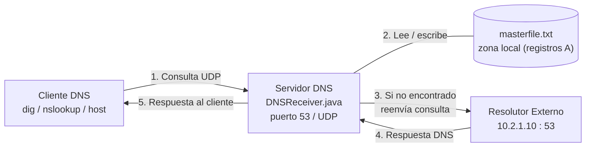
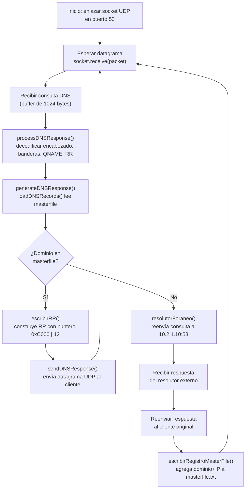
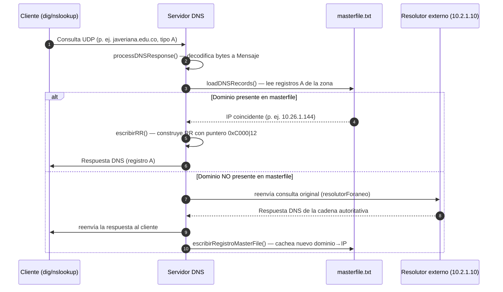

# Servidor DNS (Java) — ProyectoServidorDNS

> 🌐 [Read this README in English](README.md)

Servidor DNS en Java sobre UDP que escucha en el puerto 53, decodifica las
consultas DNS, resuelve los dominios desde un **master file** (zona local) y,
cuando el dominio no se encuentra localmente, reenvía la consulta a un
resolutor externo (`10.2.1.10`), cachea el nuevo mapeo en disco y devuelve la
respuesta al cliente.

---

## Tabla de contenidos

1. [Descripción general](#descripción-general)
2. [Arquitectura](#arquitectura)
3. [Estructura del mensaje DNS](#estructura-del-mensaje-dns)
4. [Flujo de resolución](#flujo-de-resolución)
5. [Diagrama de secuencia](#diagrama-de-secuencia)
6. [Explicación del código](#explicación-del-código)
7. [Cómo ejecutar](#cómo-ejecutar)
8. [Formato del master file](#formato-del-master-file)
9. [Limitaciones](#limitaciones)

---

## Descripción general

El proyecto es una implementación docente de un servidor DNS. Se compone de
tres elementos:

| Archivo             | Función                                                                                  |
| ------------------- | ---------------------------------------------------------------------------------------- |
| `DNSReceiver.java`  | Servidor principal: escucha en UDP/53, decodifica el mensaje, resuelve local o reenvía.   |
| `Mensaje.java`      | POJO que modela un mensaje DNS (encabezado, banderas, pregunta, RR, mapa dominio→IP).     |
| `masterfile.txt`    | Archivo de zona con registros `A` (dominio → IPv4) que hace de base de datos local.       |
| `masterfilev2.txt`  | Archivo de zona ampliado con más dominios (ejemplo alternativo).                          |

El servidor implementa dos caminos de resolución:

1. **Resolución local** — si el dominio consultado existe en `masterfile.txt`,
   se construye directamente una respuesta DNS y se envía al cliente.
2. **Resolución recursiva/foránea** — si el dominio no está en el master file,
   la consulta original se reenvía al resolutor externo `10.2.1.10:53`, su
   respuesta se reenvía al cliente y el par `dominio → IP` obtenido se
   **cacha** en `masterfile.txt`.

---

## Arquitectura



El servidor es un bucle UDP de un solo hilo (`DatagramSocket` enlazado al
puerto 53). Cada datagrama se parsea a un objeto `Mensaje`, luego se genera
una respuesta o se reenvía la consulta; en este último caso el nuevo registro
se persiste en el master file.

---

## Estructura del mensaje DNS

Un mensaje DNS (RFC 1035) es un único bloque de bytes compuesto por el
**encabezado**, la sección de **pregunta** y las secciones de
**respuesta / autoridad / adicional**. El código decodifica y reconstruye
estos campos manualmente con `DataInputStream` y `DataOutputStream`.

### Encabezado (12 bytes)

| Offset | Tamaño | Campo     | Descripción                                   | Lectura en `DNSReceiver.java`            |
| ------ | ------ | --------- | --------------------------------------------- | ---------------------------------------- |
| 0      | 2      | `ID`      | Identificador de transacción (req ↔ resp).    | `dataInputStream.readShort()` — `:59`    |
| 2      | 2      | `FLAGS`   | Campo de bits (ver tabla de banderas).        | `readByte()` x2 — `:64,84`               |
| 4      | 2      | `QDCOUNT` | Número de entradas en la sección de pregunta. | `:97`  |
| 6      | 2      | `ANCOUNT` | Número de registros en la sección de respuesta.| `:99`  |
| 8      | 2      | `NSCOUNT` | Número de registros de autoridad.              | `:101` |
| 10     | 2      | `ARCOUNT` | Número de registros adicionales.               | `:103` |

### Banderas (2 bytes, a nivel de bits)

```
                1  1  1  1  1  1
  0  1  2  3  4  5  6  7  8  9  0  1  2  3  4  5
 +--+--+--+--+--+--+--+--+--+--+--+--+--+--+--+--+
 |QR|  Opcode |AA|TC|RD|RA|   Z    |   RCODE   |
 +--+--+--+--+--+--+--+--+--+--+--+--+--+--+--+--+
```

| Bandera | Bit(s)   | Significado                                                            | Decodificación     |
 | ------- | -------- | ---------------------------------------------------------------------- | ------------------ |
 | `QR`    | 1        | 0 = consulta, 1 = respuesta.                                           | `:66` |
 | `Opcode`| 4 bits   | 0 = consulta estándar (QUERY), otros permitidos.                        | `:68` |
 | `AA`    | 1        | Authoritative Answer (respuesta autoritativa).                          | `:70` |
 | `TC`    | 1        | TrunCation (mensaje truncado).                                          | `:72` |
 | `RD`    | 1        | Recursion Desired (lo fija el cliente).                                 | `:74` |
 | `RA`    | 1        | Recursion Available (lo fija el servidor).                              | `:86` |
 | `Z`     | 3        | Reservado (debe ser 0).                                                 | `:88` |
 | `RCODE` | 4        | Código de respuesta (0 = NO ERROR).                                     | `:90` |

### Sección de pregunta

| Campo     | Tamaño | Descripción                                                              | Lectura    |
 | --------- | ------ | ----------------------------------------------------------------------- | ---------- |
 | `QNAME`   | var    | Dominio codificado como secuencia de etiquetas prefijadas por su longitud, termina en `0`. | `:113-123` |
 | `QTYPE`   | 2      | Tipo de registro solicitado (p. ej. `1` = A).                            | `:125`     |
 | `QCLASS`  | 2      | Clase (p. ej. `1` = IN).                                                 | `:127`     |

### Resource Record (respuesta / autoridad / adicional)

| Campo       | Tamaño | Descripción                                                          |
 | ----------- | ------ | -------------------------------------------------------------------- |
 | `NAME`      | var    | Nombre de dominio, suele ser un **puntero de compresión** (bits superiores = `11`). |
 | `TYPE`      | 2      | Tipo de RR (A, NS, CNAME, …).                                         |
 | `CLASS`     | 2      | Clase del RR (IN, …).                                                 |
 | `TTL`       | 4      | Time to live (segundos).                                              |
 | `RDLENGTH`  | 2      | Longitud de `RDATA`.                                                  |
 | `RDATA`     | var    | Carga útil (para un registro A, 4 bytes = la dirección IPv4).         |

> El servidor detecta los punteros de compresión verificando los dos bits
> superiores del siguiente byte: `(firstBytes & 0b11000000) >>> 6 == 3` —
> ver `DNSReceiver.java:138`.

---

## Flujo de resolución



Puntos clave de decisión:

- `generateDNSResponse()` devuelve `null` cuando el dominio **no** está en
  el master file; esta es la señal que usa `main()` para invocar
  `resolutorForaneo()` (`DNSReceiver.java:29-33`).
- `escribirRR()` escribe la respuesta usando un **puntero de compresión**
  (`0xC000 | 12`) que apunta de vuelta al `QNAME` de la sección de pregunta,
  evitando duplicarlo (`DNSReceiver.java:297`).

---

## Diagrama de secuencia



---

## Explicación del código

### `DNSReceiver.java`

| Método                          | Líneas   | Responsabilidad                                                                                       |
 | ------------------------------- | -------- | ----------------------------------------------------------------------------------------------------- |
 | `main`                          | `10-39`  | Enlaza `DatagramSocket` en el puerto 53 y ejecuta el bucle de recepción. Llama al resolver o al foráneo. |
 | `processDNSResponse`            | `41-214` | Decodifica los bytes crudos a un `Mensaje`: encabezado, banderas (bit a bit), QNAME, respuestas (con compresión). |
 | `loadDNSRecords`                | `216-237`| Parsea `masterfile.txt` y devuelve un `Map<dominio, ip>` de registros `A`.                            |
 | `generateDNSResponse`           | `239-273`| Construye los bytes de la respuesta DNS: encabezado, eco de la pregunta y un RR de respuesta del master file. |
 | `escribirPregunta`              | `275-284`| Codifica un dominio en etiquetas `QNAME` (con prefijo de longitud, termina en `0`).                   |
 | `escribirRR`                     | `286-327`| Escribe un Resource Record para el dominio coincidente: puntero, TYPE, CLASS, TTL, RDLENGTH, RDATA (IP). |
 | `sendDNSResponse`               | `329-338`| Envía el datagrama armado de vuelta a la dirección/puerto del cliente.                                  |
 | `escribirRegistroMasterFile`    | `340-351`| Agrega una nueva línea `dominio IN A ip` a `masterfile.txt` (caché).                                   |
 | `resolutorForaneo`              | `353-388`| Abre un segundo socket, reenvía la consulta a `10.2.1.10:53`, reenvía la respuesta y la cachea.        |

### `Mensaje.java`

Contenedor de datos con getters/setters para cada campo de un mensaje DNS:

- Encabezado: `id`, `flags`, `QR`, `opCode`, `AA`, `TC`, `RD`, `RA`, `Z`, `RCODE`.
- Contadores: `QDCOUNT`, `ANCOUNT`, `NSCOUNT`, `ARCOUNT`.
- Pregunta: `QNAME`, `longEtiqueta`, `QTYPE`, `QCLASS`.
- RR / respuesta: `TYPE`, `CLASS`, `TTL`, `RDLENGTH`.
- `dominioIp` (`Map<String,String>`): mapea IP → dominio extraído de la
  sección de respuestas; luego lo usa `resolutorForaneo()` para cachear el registro.
- `imprimirBytes()` (`Mensaje.java:250`): imprime los bytes crudos del
  datagrama recibido (helper de depuración).

---

## Cómo ejecutar

### Requisitos

- JDK 8+ (usa `java.io`, `java.net`, `java.nio.charset`, colecciones).
- Un sistema tipo Unix con `sudo` (el puerto 53 es privilegiado) — **ver
  [Limitaciones](#limitaciones) para el problema de la ruta Windows**.

### Compilar y ejecutar

```bash
# 1. Compilar ambas clases
javac DNSReceiver.java Mensaje.java

# 2. Ejecutar como root (puerto 53 es privilegiado)
sudo java DNSReceiver
```

El servidor arranca y se queda bloqueado esperando consultas.

### Probarlo

Desde otra terminal, consulta directamente al servidor:

```bash
# Dominio presente en masterfile.txt (resolución local)
dig @127.0.0.1 javeriana.edu.co A +short

# Dominio NO presente (camino del resolutor foráneo, luego se cachea)
dig @127.0.0.1 example.com A +short
```

Tras la segunda consulta, `masterfile.txt` debería contener el nuevo
registro agregado por `escribirRegistroMasterFile()`.

---

## Formato del master file

`masterfile.txt` sigue la sintaxis clásica de archivo de zona:

```
; Líneas de comentario comienzan con punto y coma

<dominio>     IN  A   <IPv4>
```

Ejemplo (`masterfile.txt`):

```
javeriana.edu.co          IN  A   10.26.1.144
gobiernobogota.gov.co     IN  A   52.232.179.209
```

Solo se reconocen registros `A` — ver `loadDNSRecords()` en
`DNSReceiver.java:225`:

```java
if (parts.length >= 4 && parts[2].equals("A")) { ... }
```

---

## Limitaciones

1. **Ruta Windows hardcodeada.** `loadDNSRecords()` (`DNSReceiver.java:219`)
   y `escribirRegistroMasterFile()` (`DNSReceiver.java:343`) abren:
   ```
   C:\Users\estudiante\IdeaProjects\servidorDNS\src\masterfile.txt
   ```
   En Linux/macOS el programa no encontrará el archivo. Reemplaza esas
   cadenas por una ruta relativa (`"masterfile.txt"`) o pásala como
   argumento antes de ejecutar.

2. **Puerto privilegiado.** Enlazar el puerto UDP 53 requiere root/sudo en
   sistemas tipo Unix, o `CAP_NET_BIND_SERVICE` en Linux.

3. **Un solo hilo.** El servidor procesa un datagrama a la vez en un
   `while(true)`; un resolutor foráneo lento bloquea consultas posteriores.

4. **Sin soporte TCP.** Solo se implementa UDP (RFC 1035 también define DNS
   sobre TCP, p. ej. para transferencias de zona o respuestas truncadas).

5. **Tipos de RR limitados.** Solo se decodifican/cachan registros `A`
   (IPv4); `CNAME`, `MX`, `AAAA`, `NS`, etc. se ignoran.

6. **Sin control de duplicados al cachar.**
   `escribirRegistroMasterFile()` siempre agrega, por lo que un mismo
   dominio puede quedar escrito varias veces en el master file a lo largo
   de distintas ejecuciones.
