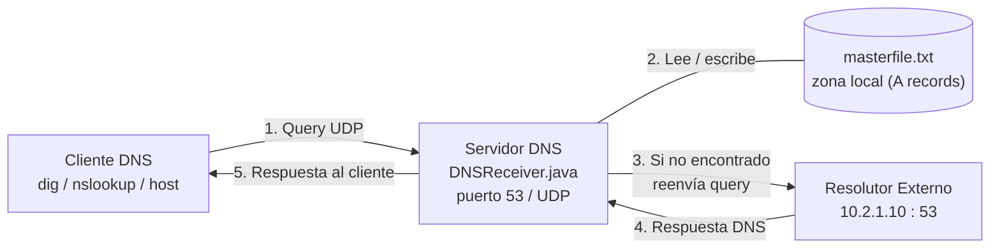
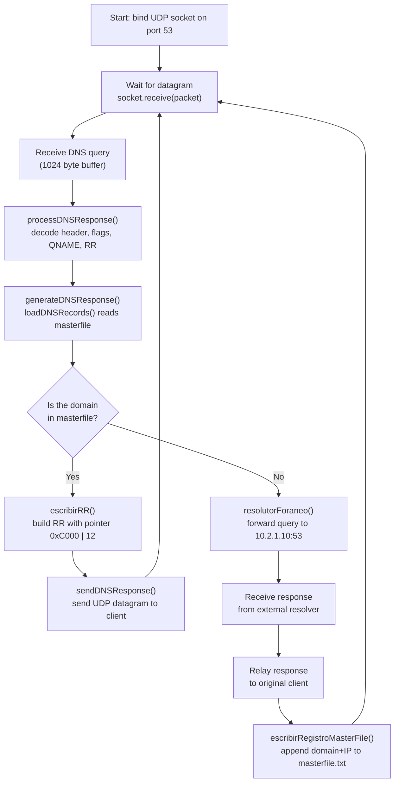
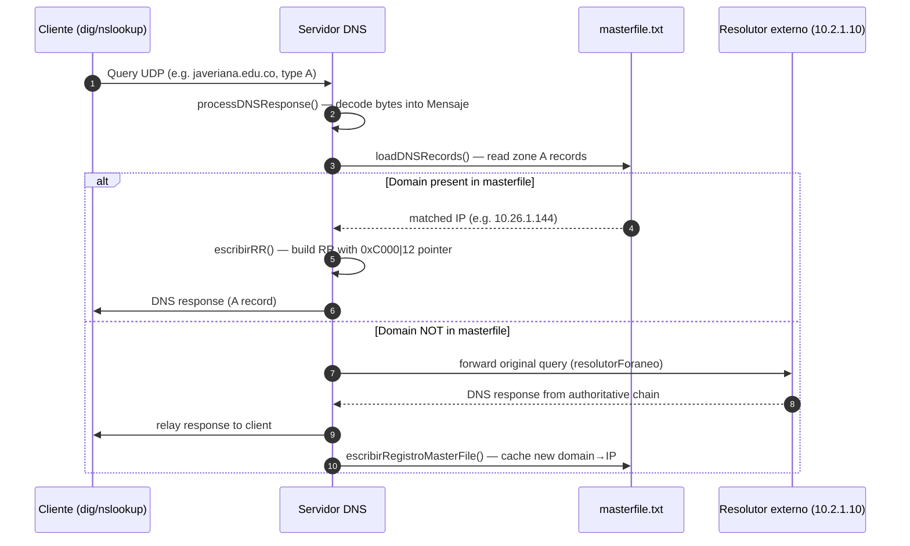

# DNS Server (Java) — ProyectoServidorDNS

> 🌐 [Lee este README en español](README.es.md)

A UDP DNS server written in Java that listens on port 53, decodes DNS queries,
resolves domains from a local **master file** (zone), and — when the domain is
not found locally — forwards the query to an external resolver
(`10.2.1.10`), caches the new mapping back to disk, and returns the answer
to the client.

---

## Table of contents

1. [Overview](#overview)
2. [Architecture](#architecture)
3. [DNS message structure](#dns-message-structure)
4. [Resolution flow](#resolution-flow)
5. [Sequence diagram](#sequence-diagram)
6. [Code walkthrough](#code-walkthrough)
7. [How to run](#how-to-run)
8. [Master file format](#master-file-format)
9. [Limitations](#limitations)

---

## Overview

The project is a teaching implementation of a DNS server. It is made up of
three building blocks:

| File                | Role                                                                                  |
| ------------------- | ------------------------------------------------------------------------------------- |
| `DNSReceiver.java`  | Main server: listens on UDP/53, decodes the message, resolves locally or forwards.    |
| `Mensaje.java`      | POJO that models a DNS message (header, flags, question, RR, domain→IP map).          |
| `masterfile.txt`    | Zone file with `A` records (domain → IPv4) used as the local database.                 |
| `masterfilev2.txt`  | Extended zone file with more domains (alternative sample).                              |

The server implements two resolution paths:

1. **Local resolution** — if the queried domain exists in `masterfile.txt`,
   a DNS response is built directly and sent back to the client.
2. **Recursive/foreign resolution** — if the domain is not in the master file,
   the original query is forwarded to the external resolver `10.2.1.10:53`,
   its response is relayed to the client, and the new `domain → IP` pair is
   appended to `masterfile.txt` (caching).

---

## Architecture



The server is a single-threaded UDP loop (`DatagramSocket` bound to port 53).
Each datagram is parsed into a `Mensaje`, then a response is generated or the
query is forwarded; in the latter case the new record is persisted to the
master file.

---

## DNS message structure

A DNS message (RFC 1035) is a single block of bytes composed of a **header**,
a **question** section and the **answer / authority / additional** sections.
The code decodes and rebuilds these fields manually with `DataInputStream`
and `DataOutputStream`.

### Header (12 bytes)

| Offset | Length | Field     | Description                                  | Read in `DNSReceiver.java` |
| ------ | ------ | --------- | -------------------------------------------- | -------------------------- |
| 0      | 2      | `ID`      | Transaction identifier (request ↔ response).  | `dataInputStream.readShort()` — `DNSReceiver.java:59` |
| 2      | 2      | `FLAGS`   | Bit field (see flags table below).           | `readByte()` x2 — `DNSReceiver.java:64,84` |
| 4      | 2      | `QDCOUNT` | Number of entries in the question section.   | `:97`  |
| 6      | 2      | `ANCOUNT` | Number of resource records in the answer.     | `:99`  |
| 8      | 2      | `NSCOUNT` | Number of authority records.                  | `:101` |
| 10     | 2      | `ARCOUNT` | Number of additional records.                 | `:103` |

### Flags (2 bytes, bit-level)

```
                1  1  1  1  1  1
  0  1  2  3  4  5  6  7  8  9  0  1  2  3  4  5
 +--+--+--+--+--+--+--+--+--+--+--+--+--+--+--+--+
 |QR|  Opcode |AA|TC|RD|RA|   Z    |   RCODE   |
 +--+--+--+--+--+--+--+--+--+--+--+--+--+--+--+--+
```

| Flag   | Bit(s)   | Meaning                                                                 | Decoded at         |
 | ------ | -------- | ----------------------------------------------------------------------- | ------------------ |
 | `QR`   | 1        | 0 = query, 1 = response.                                                | `:66` |
 | `Opcode` | 4 bits | 0 = standard query (QUERY), others allowed.                              | `:68` |
 | `AA`   | 1        | Authoritative Answer.                                                    | `:70` |
 | `TC`   | 1        | TrunCation (message was truncated).                                       | `:72` |
 | `RD`   | 1        | Recursion Desired (set by the client).                                   | `:74` |
 | `RA`   | 1        | Recursion Available (set by the server).                                | `:86` |
 | `Z`    | 3        | Reserved (must be 0).                                                    | `:88` |
 | `RCODE`| 4        | Response code (0 = NO ERROR).                                            | `:90` |

### Question section

| Field    | Length | Description                                                              | Read at  |
 | -------- | ------ | ------------------------------------------------------------------------ | -------- |
 | `QNAME`  | var    | Domain encoded as a sequence of labels prefixed by their length, ends in `0`. | `:113-123` |
 | `QTYPE`  | 2      | Type of record requested (e.g. `1` = A).                                | `:125`   |
 | `QCLASS` | 2      | Class (e.g. `1` = IN).                                                   | `:127`   |

### Resource Record (answer / authority / additional)

| Field      | Length | Description                                                          |
 | ---------- | ------ | -------------------------------------------------------------------- |
 | `NAME`     | var    | Domain name, often a **compression pointer** (top two bits = `11`).    |
 | `TYPE`     | 2      | RR type (A, NS, CNAME, …).                                            |
 | `CLASS`    | 2      | RR class (IN, …).                                                     |
 | `TTL`      | 4      | Time to live (seconds).                                              |
 | `RDLENGTH`| 2      | Length of `RDATA`.                                                   |
 | `RDATA`    | var    | Payload (for an A record, 4 bytes = the IPv4 address).                |

> The server detects compression pointers by checking the top two bits of
> the next byte: `(firstBytes & 0b11000000) >>> 6 == 3` — see
> `DNSReceiver.java:138`.

---

## Resolution flow



Key decision points:

- `generateDNSResponse()` returns `null` when the domain is **not** in the
  master file — this is the signal used by `main()` to invoke
  `resolutorForaneo()` (`DNSReceiver.java:29-33`).
- `escribirRR()` writes the answer using a **compression pointer**
  (`0xC000 | 12`) that points back to the `QNAME` in the question section,
  avoiding duplication (`DNSReceiver.java:297`).

---

## Sequence diagram



---

## Code walkthrough

### `DNSReceiver.java`

| Method                          | Lines    | Responsibility                                                                                       |
 | ------------------------------- | -------- | --------------------------------------------------------------------------------------------------- |
 | `main`                          | `10-39`  | Binds `DatagramSocket` on port 53 and runs the receive loop. Calls the resolver or the foreign path. |
 | `processDNSResponse`            | `41-214` | Decodes the raw bytes into a `Mensaje`: header, flags (bitwise), QNAME, answers (with compression). |
 | `loadDNSRecords`                | `216-237`| Parses `masterfile.txt` and returns a `Map<domain, ip>` of `A` records.                              |
 | `generateDNSResponse`           | `239-273`| Builds the DNS response bytes: header, question echo, and one answer RR from the master file.       |
 | `escribirPregunta`              | `275-284`| Encodes a domain into `QNAME` labels (length-prefixed, ends in `0`).                                |
 | `escribirRR`                    | `286-327`| Writes a Resource Record for the matching domain: pointer, TYPE, CLASS, TTL, RDLENGTH, RDATA (IP).   |
 | `sendDNSResponse`               | `329-338`| Sends the assembled datagram back to the client's address/port.                                     |
 | `escribirRegistroMasterFile`    | `340-351`| Appends a new `domain IN A ip` line to `masterfile.txt` (cache).                                   |
 | `resolutorForaneo`              | `353-388`| Opens a second socket, forwards the query to `10.2.1.10:53`, relays the answer, and caches it.      |

### `Mensaje.java`

A data holder with getters/setters for every field of a DNS message:

- Header: `id`, `flags`, `QR`, `opCode`, `AA`, `TC`, `RD`, `RA`, `Z`, `RCODE`.
- Counts: `QDCOUNT`, `ANCOUNT`, `NSCOUNT`, `ARCOUNT`.
- Question: `QNAME`, `longEtiqueta`, `QTYPE`, `QCLASS`.
- RR / answer: `TYPE`, `CLASS`, `TTL`, `RDLENGTH`.
- `dominioIp` (`Map<String,String>`): maps IP → domain extracted from the
  answer section, later used by `resolutorForaneo()` to cache the record.
- `imprimirBytes()` (`Mensaje.java:250`): prints the raw bytes of the
  received datagram (debug helper).

---

## How to run

### Requirements

- JDK 8+ (uses `java.io`, `java.net`, `java.nio.charset`, collections).
- A Unix-like OS with `sudo` (port 53 is privileged) — **see
  [Limitations](#limitations) for the Windows path issue**.

### Compile and run

```bash
# 1. Compile both classes
javac DNSReceiver.java Mensaje.java

# 2. Run as root (port 53 is privileged)
sudo java DNSReceiver
```

The server starts and blocks waiting for queries.

### Test it

From another terminal, query the server itself:

```bash
# Domain present in masterfile.txt (local resolution)
dig @127.0.0.1 javeriana.edu.co A +short

# Domain NOT present (foreign resolver path, then cached)
dig @127.0.0.1 example.com A +short
```

After the second query, `masterfile.txt` should contain the new cached
record appended by `escribirRegistroMasterFile()`.

---

## Master file format

`masterfile.txt` follows the classic zone-file syntax:

```
; Comment lines start with a semicolon

<domain>      IN  A   <IPv4>
```

Example (`masterfile.txt`):

```
javeriana.edu.co          IN  A   10.26.1.144
gobiernobogota.gov.co     IN  A   52.232.179.209
```

Only `A` records are recognised — see `loadDNSRecords()` at
`DNSReceiver.java:225`:

```java
if (parts.length >= 4 && parts[2].equals("A")) { ... }
```

---

## Limitations

1. **Hardcoded Windows path.** `loadDNSRecords()` (`DNSReceiver.java:219`)
   and `escribirRegistroMasterFile()` (`DNSReceiver.java:343`) open:
   ```
   C:\Users\estudiante\IdeaProjects\servidorDNS\src\masterfile.txt
   ```
   On Linux/macOS the program will not find the file. Replace those strings
   with a relative path (`"masterfile.txt"`) or pass the path as an
   argument before running.

2. **Privileged port.** Binding UDP port 53 requires root/sudo on Unix-like
   systems, or `CAP_NET_BIND_SERVICE` on Linux.

3. **Single-threaded.** The server processes one datagram at a time in a
   `while(true)` loop; a slow foreign resolver blocks subsequent queries.

4. **No TCP support.** Only UDP is implemented (RFC 1035 also defines DNS
   over TCP, e.g. for zone transfers or truncated responses).

5. **Limited RR types.** Only `A` (IPv4) records are decoded/cached; `CNAME`,
   `MX`, `AAAA`, `NS`, etc. are ignored.

6. **No duplicate check when caching.** `escribirRegistroMasterFile()`
   always appends, so the same domain may be written multiple times to the
   master file across runs.
